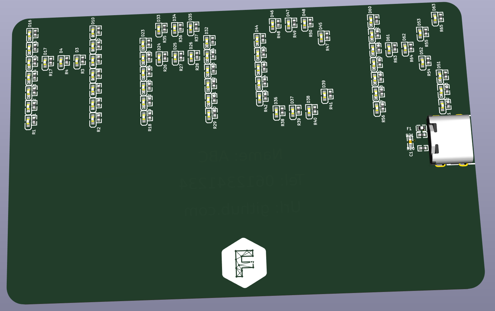

# PixelCard

 

Business card generator with lots of blinky lights - PixelCard

     

## About
PixelCard is a business card generator with lots of blinky lights. It is a showcase for the versatility of faebryk, an open-source EDA (Electronic Design Automation) tool.
With PixelCard, you can create custom business cards that feature text filled with LEDs!
The project features:
- Auto-routing of the PCB
- Auto-placement of the components
- Design 100% defined in python
- Custom font support
- USB-C PD for power (5V)
- Over current protection
- ISO/IEC_7810 ID-1 credit card form factor

This project is build with the open-source EDA [faebryk](https://github.com/faebryk/faebryk).

## Working with the source files

See [here](https://hackaday.io/project/196784-pixelcard#menu-instructions) for the instructions on how to install and edit this project.

## Building

If you want to build the physical output of this project you can find the build instructions [here](./docs/build_instructions.md).

## Contributing

If you want to share your alterations, improvements, or add bugfixes to this project, please take a look at the [contributing guidelines](./docs/CONTRIBUTING.md).

## Community Support

Community support is provided via Discord; see the Resources below for details.

### Resources

- Hackaday.io: [Project Page](https://hackaday.io/project/196784-pixelcard)
- Source Code: [Github](https://github.com/ruben-iteng/pixelcard)
- Chat: Real-time chat happens in faebryk's Discord Server (chit-chat room for now). Use this Discord [Invite](https://discord.gg/95jYuPmnUW) to register
- Issues: [Issues](https://github.com/ruben-iteng/pixelcard/issues)
